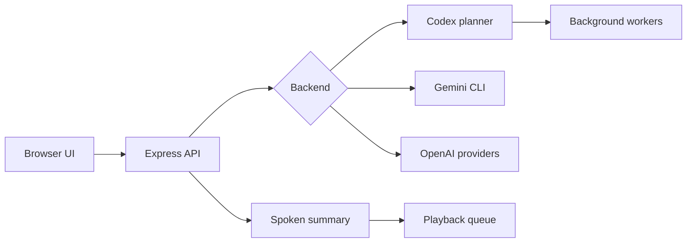

# Local Voice Assistant

Local Voice Assistant is a local web app for talking to a planning agent, keeping the full response visible, and hearing a concise spoken summary. It can also delegate concrete project work to background Codex CLI worker sessions.

## What It Does

- Push-to-talk browser UI with live microphone activity.
- Browser speech recognition with typed fallback.
- Server-side planner context that survives refreshes and failed turns.
- Full response history on screen.
- Short spoken summaries with a playback queue to prevent overlapping notifications.
- Background worker sessions for Codex CLI tasks.
- Optional Gemini CLI and OpenAI cloud voice/transcription modes.

## Modes

### Codex Command Center

Default mode. The main session focuses on conversation, planning, and coordination. Actionable requests can start background worker sessions that run Codex CLI in the configured workspace.

Worker modes:

- `execute`: workers may edit files in `CODEX_WORKDIR`
- `plan`: workers inspect and plan without editing

### Gemini CLI

Uses browser speech recognition plus Gemini CLI for the assistant response. Run `npm run gemini:login` first.

### OpenAI Cloud Voice

Uses OpenAI cloud transcription, assistant response, and text-to-speech audio. Requires `OPENAI_API_KEY`.

## Quick Start

```bash
npm install
npm run dev
```

Open:

```text
http://127.0.0.1:5173
```

The Express API runs on:

```text
http://127.0.0.1:8787
```

## Configuration

Copy `.env.example` to `.env` when you need custom settings.

```bash
cp .env.example .env
```

Important values:

- `PORT`: local API port, default `8787`
- `OPENAI_API_KEY`: required for OpenAI cloud modes only
- `CODEX_WORKDIR`: workspace folder for Codex CLI workers
- `SUMMARY_WORDS`: target spoken-summary length
- `TTS_VOICE`: OpenAI voice name for cloud voice mode

## Codex CLI Setup

```bash
npm install -g @openai/codex
codex doctor
```

Then start the app and choose Codex mode in Settings.

## Gemini CLI Setup

```bash
npm run gemini:login
```

Complete the browser login, then restart the app.

## Local State

The app writes runtime state to `work/`, including:

- planner session memory
- temporary audio files
- Codex run output
- background worker reports

`work/` is ignored by Git because it may contain private transcripts, project context, and local execution details.

## Architecture

Read [docs/ARCHITECTURE.md](docs/ARCHITECTURE.md) for the system flow and API boundaries.

Short version:



## Safety

This is a local-first tool. Do not expose the API to the public internet. In Codex execute mode, workers may edit files inside `CODEX_WORKDIR`; use plan mode for read-only worker sessions.

See [SECURITY.md](SECURITY.md).

## Development Checks

```bash
npm test -- --run
npm run build
```

## License

MIT
