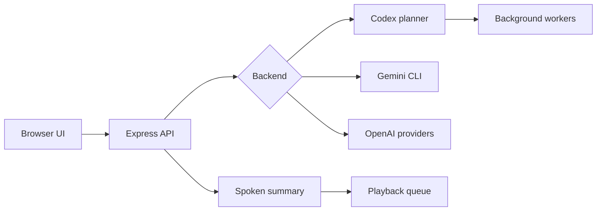

# Local Voice Assistant

Local Voice Assistant is a local web app for talking to a planning agent, keeping the full response visible, and hearing a concise spoken summary. It can also delegate concrete project work to background Codex CLI worker sessions.

## What It Does

- Push-to-talk browser UI with live microphone activity.
- Optional wake phrase listener: say `Tensoon` while the app is idle to start a command.
- Browser speech recognition with typed fallback.
- Server-side planner context that survives refreshes and failed turns.
- Full response history on screen.
- Short spoken summaries with a playback queue to prevent overlapping notifications.
- Background worker sessions for Codex CLI tasks.
- Voice-native worker commands for focusing, inspecting, continuing, cancelling, and archiving sessions.
- Session supervision that separates stale work, user-needed blockers, and agent-actionable issues.
- Activity timeline for mode changes, worker lifecycle events, inspections, and notifications.
- Optional Gemini CLI and OpenAI cloud voice/transcription modes.

## Modes

### Codex Command Center

Default mode. The main session focuses on conversation, planning, and coordination. Actionable requests can start background worker sessions that run Codex CLI in the configured workspace.

Worker modes:

- `execute`: workers may edit files in `CODEX_WORKDIR`
- `plan`: workers inspect and plan without editing

When Codex mode is set to `plan`, the main agent can pause before delegation and ask structured planning questions. Those questions appear in the app as a planning panel and remain answerable by voice or typed fallback.

### Gemini CLI

Uses browser speech recognition plus Gemini CLI for the assistant response. Run `npm run gemini:login` first.

### OpenAI Cloud Voice

Uses OpenAI cloud transcription, assistant response, and text-to-speech audio. Requires `OPENAI_API_KEY`.

## Quick Start

```bash
npm install
npm run dev
```

Open:

```text
http://127.0.0.1:5173
```

The Express API runs on:

```text
http://127.0.0.1:8787
```

## Configuration

Copy `.env.example` to `.env` when you need custom settings.

```bash
cp .env.example .env
```

Important values:

- `PORT`: local API port, default `8787`
- `OPENAI_API_KEY`: required for OpenAI cloud modes only
- `CODEX_WORKDIR`: workspace folder for Codex CLI workers
- `SUMMARY_WORDS`: target spoken-summary length
- `TTS_VOICE`: OpenAI voice name for cloud voice mode

## Codex CLI Setup

```bash
npm install -g @openai/codex
codex doctor
```

Then start the app and choose Codex mode in Settings.

## Gemini CLI Setup

```bash
npm run gemini:login
```

Complete the browser login, then restart the app.

## Local State

The app writes runtime state to `work/`, including:

- planner session memory
- recent activity timeline
- temporary audio files
- Codex run output
- background worker reports

Completed, blocked, failed, and cancelled worker cards are restored from saved reports after a server restart. Running processes are not resumed; start a follow-up worker when a restarted session needs more work.

The browser stores local UI preferences such as backend, Codex plan/execute mode, transcription mode, assistant style, wake phrase, mute, and volume. Server defaults from `.env` are used first, then valid browser preferences are applied on top.

`work/` is ignored by Git because it may contain private transcripts, project context, and local execution details.

## Wake Phrase

Enable **Wake on "tensoon"** in Settings to arm the idle browser-speech listener. When the app hears `Tensoon` or likely transcript variants such as `ten soon`, it switches into the normal recording flow.

This uses browser speech recognition, so support depends on the browser and microphone permissions. Push-to-talk remains available even when wake phrase support is unavailable.

## Session Supervision

Background workers include a supervision signal:

- `normal`: no action needed
- `stale`: the worker has been running longer than expected; inspect logs before interrupting
- `needs-user`: credentials, approval, a manual choice, or permission is needed
- `auto-actionable`: the worker hit a technical issue the agent can usually handle

Only `needs-user` sessions are treated as interrupt-worthy spoken notifications. Other states stay visible in the worker cards.

Use **Inspect** on a worker card to check captured output before escalating. If no concrete issue is found, the result stays as a quiet page note. If the inspection finds a user-needed blocker, it is read aloud.

Worker cards also support:

- **Focus**: make a worker the active context for follow-up voice prompts
- **Continue**: start a follow-up worker from the current report
- **Archive**: hide completed or stopped sessions from the main dashboard
- **Show archived**: bring archived sessions back into view

The **Activity** panel keeps a recent timeline of command decisions and worker changes, including mode switches, focused workers, inspections, queued workers, completions, cancellations, and archived sessions.

The same controls are available by voice in Codex mode:

- `focus the latest worker`
- `inspect the current worker`
- `continue the focused session`
- `cancel the current worker`
- `archive completed workers`
- `switch to plan mode`
- `use execute mode`
- `what mode are we in`
- `start a new chat`
- `catch me up on the planning session`

## Architecture

Read [docs/ARCHITECTURE.md](docs/ARCHITECTURE.md) for the system flow and API boundaries.

Short version:



## Safety

This is a local-first tool. Do not expose the API to the public internet. In Codex execute mode, workers may edit files inside `CODEX_WORKDIR`; use plan mode for read-only worker sessions.

See [SECURITY.md](SECURITY.md).

## Development Checks

```bash
npm test -- --run
npm run build
```

## License

MIT
