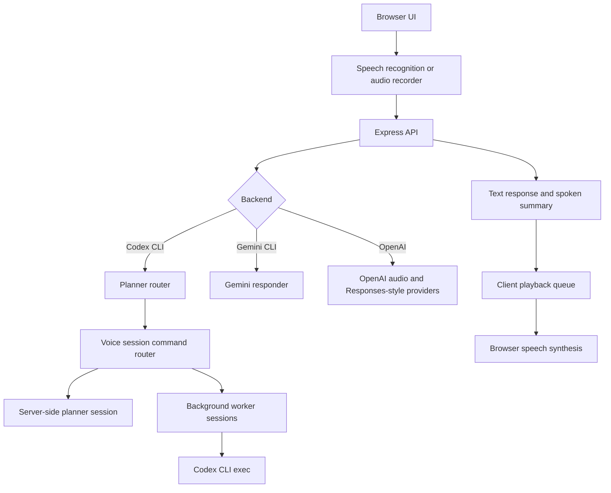

# Architecture

Local Voice Assistant is split into a React client, an Express API, provider modules, and local runtime state.

## Client

The React app handles microphone permission, push-to-talk controls, wake phrase activation, live transcript display, typed fallback input, worker session cards, readiness indicators, settings, and playback controls.

Spoken notifications pass through a playback queue. Long summaries are split into short chunks to avoid browser `SpeechSynthesisUtterance` cutoffs and overlapping worker notifications.

Local playback commands such as `repeat last response` are intercepted in the client before a turn is sent to the API. They replay the latest spoken summary or response text through the same queue, preserving planner memory.

Settings are initialized from the server defaults and then merged with validated browser `localStorage` preferences. This keeps user choices such as backend, Codex plan/execute mode, transcription mode, assistant style, wake phrase, mute, and volume stable across page refreshes without trusting malformed saved values.

The visible command examples in Settings and the spoken "what can I say" response both read from `shared/voiceCommandCatalog.ts`, keeping discoverability aligned with the command router. Settings examples are clickable quick-fill prompts for the typed fallback composer.

The typed fallback composer stores its unsent draft in browser `localStorage` and clears it after a successful send, new chat, or explicit Clear draft action.

## Wake Phrase

The wake phrase is a browser-speech idle listener. When enabled, the client starts a lightweight recognition loop only while the app is idle or in an error-ready state. If it hears `Darren` or likely transcript variants, it stops the wake listener and starts the normal recording flow.

Wake phrase activation does not bypass the existing turn flow: microphone activity, auto-stop, transcript handling, server routing, and response playback still use the same code path as push-to-talk.

## Server

The Express server owns API keys and local CLI execution. It exposes:

- `GET /api/health`
- `POST /api/text-turn`
- `POST /api/text-turn/retry-last`
- `POST /api/audio-text-turn`
- `POST /api/voice-turn`
- `POST /api/cancel-turn`
- `GET /api/planner-session`
- `GET /api/planner-session/export`
- `POST /api/planner-session/reset`
- `POST /api/planner-session/retry-last`
- `GET /api/sessions`
- `GET /api/sessions/:id`
- `POST /api/sessions`
- `POST /api/sessions/:id/cancel`
- `GET /api/activity`

## Codex Planner Mode

Codex mode is a command center:

- the main planner session answers conversationally
- voice-native session commands are handled before planner delegation
- plan mode can return structured planning questions before delegation
- actionable work can be delegated to background workers
- workers run separately and return structured status reports
- worker reports are classified into normal, stale, needs-user, or auto-actionable supervision states
- the browser continues polling worker state while the main session remains available

Planner conversation and the active planning prompt are persisted in `work/planner-session.json`, which is intentionally ignored by Git.

Every Codex planner turn also receives a compact operational context built from the current worker list and recent Activity events. This keeps conversational answers grounded in the live command-center state, including supervision labels and recent inspections, without stuffing raw logs into the chat.

The planner transcript can be exported as markdown through `GET /api/planner-session/export`, and the client toolbar downloads that file as `planner-session.md`. The export includes active planning questions and their answered/pending state when a prompt is still waiting for answers.

The retry-last-turn flow calls `POST /api/text-turn/retry-last` for the full rerun, or `POST /api/planner-session/retry-last` when only the saved planner memory needs to be trimmed. The server removes the latest user/assistant pair from persisted planner memory, preserves earlier context, and reruns the previous user request. Transcribed Codex turns that match phrases such as `retry last turn` use the same server-side path.

Planning questions are returned as a `plannerPrompt` payload from `POST /api/text-turn` or `POST /api/audio-text-turn`. The server stores that prompt as `activePlannerPrompt` on the planner session, tracks per-question answered state, and clears it on the next turn that does not ask follow-up questions. The client restores the planning panel from `GET /api/planner-session` after refresh and keeps normal voice/text entry available for answers. Voice commands such as `mark goal question answered`, `mark first question pending`, and `mark all planning questions answered` update the same persisted state.

The session command router handles narrow operational phrases such as switching Codex plan/execute mode, reporting the current mode, starting a fresh planning chat, recapping the saved planning session, focusing the latest worker, inspecting the current worker, continuing the focused session, continuing agent-actionable blockers, cancelling a current worker, and archiving completed workers. Unrecognized or conversational turns fall through to the main planner so brainstorming is not swallowed by command matching.

Command responses can return updated `settings`; the client applies those settings after the turn so voice commands and the visible settings drawer remain in sync.

## Session Supervision

`sessionManager.ts` derives a `supervision` object for every background session. The client uses that signal instead of guessing from raw status text.

- Stale sessions stay quiet and visible so the agent can inspect logs first.
- User-needed blockers are surfaced and spoken.
- Technical failures are marked auto-actionable so the agent can continue without asking the user for obvious fixes.

When `GET /api/sessions` refreshes worker state, stale sessions are automatically inspected once. The server records an Activity event only when captured output includes a concrete user-needed or technical issue. Plain silence remains quiet, which keeps polling from turning into noisy false alarms.

The voice command `continue actionable blockers` starts follow-up workers only for visible blocked or failed sessions whose supervision state is `auto-actionable`. Sessions marked `needs-user` are skipped so credentials, approvals, and owner choices are not silently bypassed.

The `POST /api/sessions/:id/inspect` endpoint reads captured worker output or final raw output and returns a `SessionInspection`. The client uses it for the worker-card Inspect action. Inspections only speak when a user-needed issue is found; quiet or agent-actionable findings remain visible in the card/history surface.

Worker sessions can also be focused or archived:

- `POST /api/sessions/:id/focus` marks a worker as the active follow-up context.
- `POST /api/sessions/:id/archive` hides a completed/stopped worker from the main dashboard.

Focused session context is appended as hidden assistant context for future planner turns, so the visible transcript stays clean while follow-up voice commands can refer to "this worker" naturally.

Completed/stopped worker cards are lazily restored from `work/session-reports/*.md` when sessions are listed. The restore path is intentionally read-only: it rebuilds historical visibility and inspection context, but it does not attempt to resume child processes that were running before a server restart.

## Activity Feed

`activityFeed.ts` keeps a capped list of recent command-center events in `work/activity-events.json`. It records worker lifecycle changes, focus/archive actions, inspections, and Codex mode changes. The client polls `GET /api/activity` alongside worker sessions and renders the latest events as a compact timeline.

The activity feed survives server restarts, but it is still operational visibility rather than long-term audit storage. Full planner transcripts and worker reports live in separate files under `work/`.

## Generated State

The `work/` folder is local runtime state. It may contain planner memory, activity events, temporary audio, Codex output, and session reports. It should not be committed.
