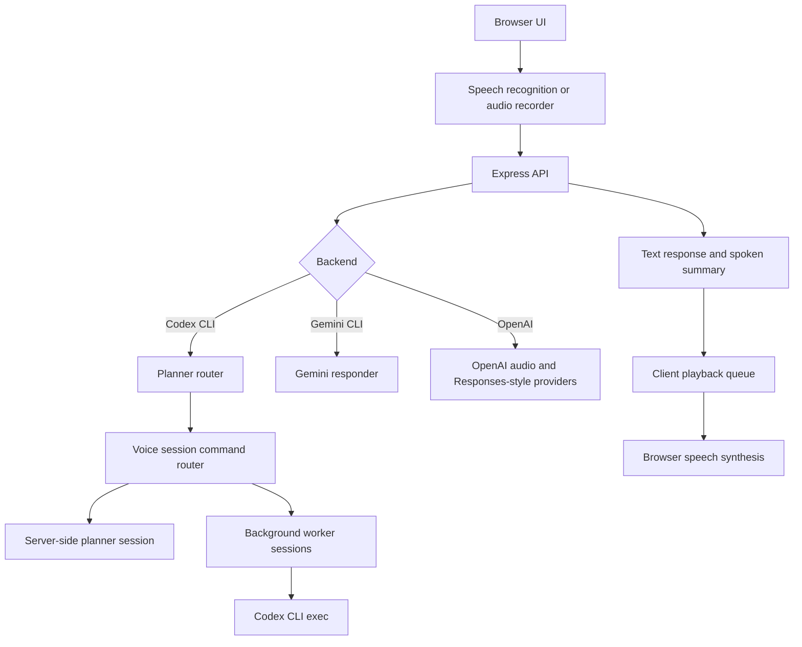

# Architecture

Local Voice Assistant is split into a React client, an Express API, provider modules, and local runtime state.

## Client

The React app handles microphone permission, push-to-talk controls, wake phrase activation, live transcript display, typed fallback input, worker session cards, settings, and playback controls.

Spoken notifications pass through a playback queue. Long summaries are split into short chunks to avoid browser `SpeechSynthesisUtterance` cutoffs and overlapping worker notifications.

Settings are initialized from the server defaults and then merged with validated browser `localStorage` preferences. This keeps user choices such as backend, Codex plan/execute mode, transcription mode, assistant style, wake phrase, mute, and volume stable across page refreshes without trusting malformed saved values.

## Wake Phrase

The wake phrase is a browser-speech idle listener. When enabled, the client starts a lightweight recognition loop only while the app is idle or in an error-ready state. If it hears `Tensoon` or likely transcript variants, it stops the wake listener and starts the normal recording flow.

Wake phrase activation does not bypass the existing turn flow: microphone activity, auto-stop, transcript handling, server routing, and response playback still use the same code path as push-to-talk.

## Server

The Express server owns API keys and local CLI execution. It exposes:

- `GET /api/health`
- `POST /api/text-turn`
- `POST /api/audio-text-turn`
- `POST /api/voice-turn`
- `POST /api/cancel-turn`
- `GET /api/planner-session`
- `POST /api/planner-session/reset`
- `GET /api/sessions`
- `GET /api/sessions/:id`
- `POST /api/sessions`
- `POST /api/sessions/:id/cancel`
- `GET /api/activity`

## Codex Planner Mode

Codex mode is a command center:

- the main planner session answers conversationally
- voice-native session commands are handled before planner delegation
- plan mode can return structured planning questions before delegation
- actionable work can be delegated to background workers
- workers run separately and return structured status reports
- worker reports are classified into normal, stale, needs-user, or auto-actionable supervision states
- the browser continues polling worker state while the main session remains available

Planner conversation is persisted in `work/planner-session.json`, which is intentionally ignored by Git.

Planning questions are returned as a `plannerPrompt` payload from `POST /api/text-turn` or `POST /api/audio-text-turn`. The client renders the payload as a planning panel and keeps normal voice/text entry available for answers.

The session command router handles narrow operational phrases such as switching Codex plan/execute mode, reporting the current mode, starting a fresh planning chat, recapping the saved planning session, focusing the latest worker, inspecting the current worker, continuing the focused session, cancelling a current worker, and archiving completed workers. Unrecognized or conversational turns fall through to the main planner so brainstorming is not swallowed by command matching.

Command responses can return updated `settings`; the client applies those settings after the turn so voice commands and the visible settings drawer remain in sync.

## Session Supervision

`sessionManager.ts` derives a `supervision` object for every background session. The client uses that signal instead of guessing from raw status text.

- Stale sessions stay quiet and visible so the agent can inspect logs first.
- User-needed blockers are surfaced and spoken.
- Technical failures are marked auto-actionable so the agent can continue without asking the user for obvious fixes.

The `POST /api/sessions/:id/inspect` endpoint reads captured worker output or final raw output and returns a `SessionInspection`. The client uses it for the worker-card Inspect action. Inspections only speak when a user-needed issue is found; quiet or agent-actionable findings remain visible in the card/history surface.

Worker sessions can also be focused or archived:

- `POST /api/sessions/:id/focus` marks a worker as the active follow-up context.
- `POST /api/sessions/:id/archive` hides a completed/stopped worker from the main dashboard.

Focused session context is appended as hidden assistant context for future planner turns, so the visible transcript stays clean while follow-up voice commands can refer to "this worker" naturally.

Completed/stopped worker cards are lazily restored from `work/session-reports/*.md` when sessions are listed. The restore path is intentionally read-only: it rebuilds historical visibility and inspection context, but it does not attempt to resume child processes that were running before a server restart.

## Activity Feed

`activityFeed.ts` keeps a capped list of recent command-center events in `work/activity-events.json`. It records worker lifecycle changes, focus/archive actions, inspections, and Codex mode changes. The client polls `GET /api/activity` alongside worker sessions and renders the latest events as a compact timeline.

The activity feed survives server restarts, but it is still operational visibility rather than long-term audit storage. Full planner transcripts and worker reports live in separate files under `work/`.

## Generated State

The `work/` folder is local runtime state. It may contain planner memory, activity events, temporary audio, Codex output, and session reports. It should not be committed.
