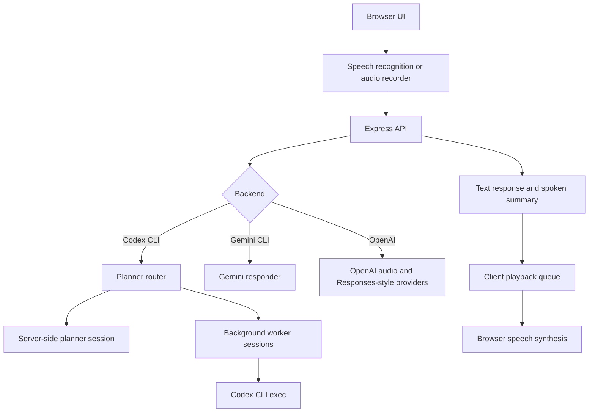

# Architecture

Local Voice Assistant is split into a React client, an Express API, provider modules, and local runtime state.

## Client

The React app handles microphone permission, push-to-talk controls, live transcript display, typed fallback input, worker session cards, settings, and playback controls.

Spoken notifications pass through a playback queue. Long summaries are split into short chunks to avoid browser `SpeechSynthesisUtterance` cutoffs and overlapping worker notifications.

## Server

The Express server owns API keys and local CLI execution. It exposes:

- `GET /api/health`
- `POST /api/text-turn`
- `POST /api/audio-text-turn`
- `POST /api/voice-turn`
- `POST /api/cancel-turn`
- `GET /api/planner-session`
- `POST /api/planner-session/reset`
- `GET /api/sessions`
- `GET /api/sessions/:id`
- `POST /api/sessions`
- `POST /api/sessions/:id/cancel`

## Codex Planner Mode

Codex mode is a command center:

- the main planner session answers conversationally
- actionable work can be delegated to background workers
- workers run separately and return structured status reports
- the browser continues polling worker state while the main session remains available

Planner conversation is persisted in `work/planner-session.json`, which is intentionally ignored by Git.

## Generated State

The `work/` folder is local runtime state. It may contain planner memory, temporary audio, Codex output, and session reports. It should not be committed.
